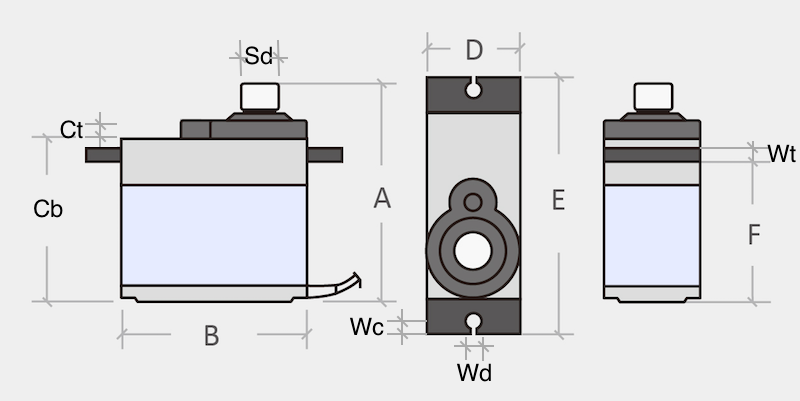
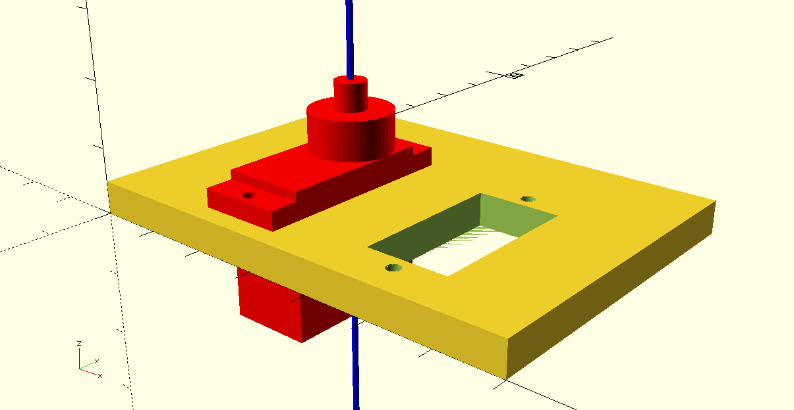

# 3D Servo Model
3D model of and supporting models for a servo  
Christophe VG <<contact@christophe.vg>>

## Introduction

I sometimes work with (micro) servos and need to create 3D prints or cuts to create prototypes that run using the servos. This repository contains OpenSCAD supporting modules to do that.
## Servo Dimensions

Although that (micro) servos "can" have "standard" dimensions, there are always small differences. The modules are therefore configurable with 11 parameters. The following image illustrates these:



The resulting model provides two modules: one of the servo and one that can be used to subtract from another shape to create a mounting hole. The demo module illustrates this:

```js
module demo() {
  difference() {
    cube([ 70, 50, 5 ] );
    translate([25, 25, 0]) { servo_mount(t=5); }
    translate([50, 25, 0]) { servo_mount(t=5); }
  }
  translate([25, 25, 5]) { color("red") { servo(); } }
  // the servo and mount are centered around the spline
  translate([25, 25, -40]) { color("blue") { cylinder(80, d=1); } }
}
```


